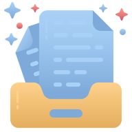

Welcome to DashLab's documentation!
===================================

**DashLab** is a project aiming to provide a dashboard with user verification allowing access to current and future coding projects from anywhere.

Features
--------

**DashLab** provides:

* A dashboard with AWS Cognito Authentication 
* Personalized access to various coding projects and tools
* Automatic documentation tools like this one for the project

.. note::
   The folder/files organization has been inspired by the SimExporter GitHub project
   make by Robin Enjalbert.

Gallery
-------

.. toctree::
    :hidden:

    Demo        <demo.rst>
    Install     <local-setup.rst>
    How to use  <usage.rst>
    API         <api.rst>
